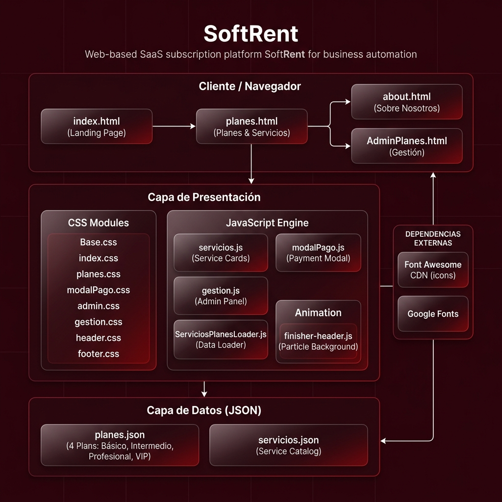

<div align="center">


# SoftRent — Plataforma de Automatización por Suscripción

**Automatiza tu negocio. Crece sin límites.**

[](https://developer.mozilla.org/es/docs/Web/HTML)
[](https://developer.mozilla.org/es/docs/Web/CSS)
[](https://developer.mozilla.org/es/docs/Web/JavaScript)
[](https://fontawesome.com)
[](#)
[](#contexto-académico)

</div>

---

## 📋 Descripción General

**SoftRent** es una plataforma web de tipo **SaaS (Software as a Service)** diseñada para que emprendedores y empresas automaticen sus procesos operativos mediante un sistema de **suscripciones modulares**. El usuario selecciona un plan base y personaliza los servicios o automatizaciones que necesita para su negocio, desde un emprendimiento hasta múltiples departamentos corporativos.

### Propuesta de Valor

| Problema del Cliente | Solución SoftRent |
|---|---|
| Tareas repetitivas que consumen horas | Automatizaciones adaptadas al negocio |
| Inventario fuera de control | Sistemas de gestión automatizados |
| Facturas y cobros olvidados | Facturación y recordatorios automáticos |
| Soporte al cliente lento | Flujos de atención automatizados |

---

## 🏗️ Arquitectura del Proyecto

```
SoftRent/
├── 📄 index.html              # Landing page principal
├── 📄 planes.html             # Catálogo de planes y servicios
├── 📄 about.html              # Página "Sobre Nosotros"
├── 📄 AdminPlanes.html        # Panel de gestión de suscripciones
│
├── 📁 css/
│   ├── Base.css               # Variables globales y reset
│   ├── index.css              # Estilos del landing
│   ├── planes.css             # Estilos de planes y catálogo
│   ├── modalPago.css          # Estilos del modal de pago (multi-paso)
│   ├── admin.css              # Estilos del panel admin
│   ├── gestion.css            # Estilos del módulo de gestión
│   ├── about.css              # Estilos de la página about
│   └── Components/
│       ├── header.css         # Header responsive con menú hamburguesa
│       └── footer.css         # Footer con info académica y redes
│
├── 📁 js/
│   ├── servicios.js           # Renderizado dinámico de tarjetas de servicio
│   ├── modalPago.js           # Lógica completa del modal de checkout multi-paso
│   ├── gestion.js             # Modales y validación del panel de gestión
│   ├── ServiciosPlanesLoader.js # Cargador de datos planes/servicios (JSON)
│   ├── index.js               # Inicialización del landing
│   └── finisher-header.es5.min.js # Motor de animación de partículas (background)
│
├── 📁 json/
│   ├── planes.json            # Definición de los 4 planes de suscripción
│   └── servicios.json         # Catálogo completo de automatizaciones/servicios
│
└── 📁 assets/
    ├── img/                   # Imágenes, logos e ilustraciones
    └── fonts/                 # Tipografías locales
```

---

## 🖼️ Diagrama de Arquitectura



> El sistema sigue una arquitectura **cliente puro** (frontend-only) de tres capas: **Vistas HTML → Lógica JS → Datos JSON**. No requiere backend ni base de datos externas en esta fase.

---

## 💡 Funcionalidades Principales

### 🏠 Landing Page (`index.html`)
- Hero animado con partículas dinámicas usando **Finisher Header**
- Presentación del proceso de trabajo en 4 pasos (Análisis → Diseño → Implementación → Optimización)
- Módulo de seguridad: Control de Accesos, Integraciones Seguras, Respaldos y Buenas Prácticas
- Previsualización de los 3 planes principales + Plan VIP
- Sección de problemas vs. soluciones comparativas

### 📦 Planes y Servicios (`planes.html`)
- Visualización de **4 planes de suscripción** cargados dinámicamente desde `planes.json`
- Catálogo de servicios filtrables por categoría (renderizado desde `servicios.json`)
- **Modal de checkout multi-paso** (`modalPago.js`) con:
  - Selección de periodicidad (mensual / anual con descuento)
  - Elección de servicios incluidos según el límite del plan
  - Cálculo dinámico del total con descuentos aplicados
  - Aplicación de códigos de descuento
  - Servicios adicionales fuera del plan base con precio individual

### 👤 Panel de Gestión (`AdminPlanes.html`)
- Visualización del estado de suscripción activa
- Edición de datos del negocio con **validación de formulario en tiempo real**
- Modales de edición y confirmación de eliminación de suscripción
- UI responsiva con layout horizontal de dos columnas

### ℹ️ Sobre Nosotros (`about.html`)
- Historia, misión y visión de SoftRent
- Presentación del equipo de desarrollo

---

## 🛠️ Stack Tecnológico

| Categoría | Tecnología | Uso |
|---|---|---|
| **Estructura** | HTML5 Semántico | Páginas y layout base |
| **Estilos** | CSS3 Vanilla | Sistema de diseño modular, variables CSS, animaciones |
| **Lógica** | JavaScript ES5/ES6 | Renderizado dinámico, modales, validaciones, cálculos |
| **Datos** | JSON | Catálogo de planes y servicios (sin backend) |
| **Iconos** | Font Awesome 6 CDN | Iconografía de toda la plataforma |
| **Animación** | Finisher Header (ES5) | Fondo de partículas animadas en todas las páginas |
| **Assets** | PNG / JPG / SVG | Ilustraciones, logos y elementos visuales |

---

## 🎨 Sistema de Diseño

La identidad visual de SoftRent usa una paleta de colores oscura con accentos en **carmesí profundo**:

| Token | Valor | Uso |
|---|---|---|
| `--color-background` | `#400517` | Fondo principal (Finisher) |
| `--particle-primary` | `#770707` | Partículas / accentos |
| `--particle-dark` | `#59031d` | Tonos oscuros de marca |
| `--color-highlight` | `#810303` | Elementos destacados |

**Tipografía:** Sistema base del navegador con Google Fonts en componentes clave.

**Patrón de Layout:** `container` → `side-header` → Secciones semánticas → `footer`

---

## 📊 Estructura de Datos

### `planes.json`
```json
{
  "id": "PLAN-BASICO",
  "nombre": "Plan Básico",
  "precio_mensual": 25480,
  "precio_anual": 244400,
  "porc_desc_anual": 20,
  "servicios_fijos": ["srv-008", "srv-009"],
  "sistemas_elegibles": 1
}
```

| Plan | Precio Mensual | Precio Anual | Sistemas Elegibles | Descuento Anual |
|---|---|---|---|---|
| Básico | ₡25,480 | ₡244,400 | 1 | 20% |
| Intermedio | ₡61,880 | ₡557,000 | 3 | 25% |
| Profesional | ₡119,080 | ₡1,285,000 | 5 | 10% |
| VIP | ₡233,480 | ₡2,522,000 | 10 (catálogo completo) | 10% |

### `servicios.json`
Catálogo de automatizaciones y servicios disponibles para cada plan. Cada entrada contiene:
- `id` — identificador único (ej. `srv-008`)
- `nombre` / `descripcion` — información del servicio
- `precio` — costo adicional si supera el límite del plan
- `icono` — clase de Font Awesome para renderizado visual
- `disponible` — booleano para filtrado en el catálogo
- `tags` — categorías para el filtro de búsqueda dinámico

---

## 🚀 Uso Local

Este proyecto es **100% frontend**, no requiere instalación de dependencias ni servidor de backend.

```bash
# 1. Clonar el repositorio
git clone https://github.com/Relict17-NotABot/SoftRent.git

# 2. Navegar al directorio
cd SoftRent

# 3. Abrir en el navegador
# Opción A: Abrir index.html directamente en tu navegador
# Opción B (recomendada): Usar Live Server en VS Code
```

> ⚠️ **Nota:** Debido al uso de `fetch()` para cargar los archivos JSON, se recomienda usar un servidor local como **Live Server** de VS Code para evitar restricciones CORS al abrir los archivos con el protocolo `file://`.

---

## 📁 Mapa de Navegación

| Página | Ruta | Descripción |
|---|---|---|
| Landing | `index.html` | Página principal con hero, proceso y planes resumidos |
| Planes | `planes.html` | Catálogo completo de planes y servicios con checkout |
| Sobre Nosotros | `about.html` | Historia, misión, visión y equipo |
| Gestión | `AdminPlanes.html` | Panel de administración de suscripción activa |

---

## 🎓 Contexto Académico

Este proyecto fue desarrollado como **Mini-Proyecto** para el curso:

> **Programación en Ambiente Web I**
> Código de grupo: II-26, C-02
> **Universidad Técnica Nacional (UTN)**
> **Profesora:** Nathalie Paniagua López

### 👥 Equipo de Desarrollo

| Desarrollador | LinkedIn |
|---|---|
| Elías Castro Soto | [](https://www.linkedin.com/in/el%C3%ADaseltro/) |
| ReLichtyy | [](#) |

---

## 🤝 Patrocinadores

<div>
  
  &nbsp;&nbsp;&nbsp;
  
</div>

---

<div align="center">

**© 2026 SoftRent — Universidad Técnica Nacional**

*Automatiza tu negocio. Crece sin límites.*

</div>
